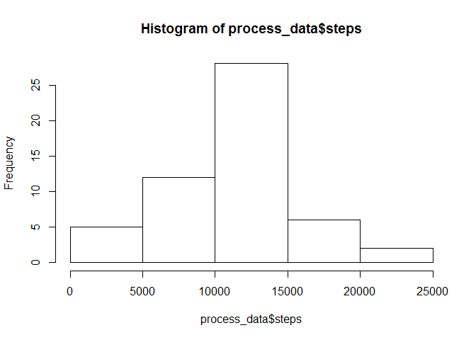
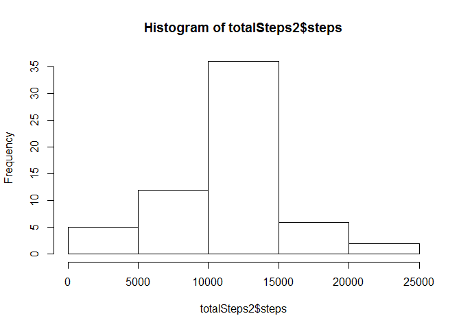

# Code: Activity Monitoring
Meet Dudhia  
Sunday, March 08, 2015  

**Assignment**

This assignment will be described in multiple parts but ultimately, need to be completed in a single R markdown document that can be processed by knitr and be transformed into an HTML file.

Always echo = TRUE is used so that someone else will be able to read the code.

```r
echo = TRUE
```

**Loading and preprocessing the data**

Show any code that is needed to

1. Load the data (i.e. read.csv())
2. Process/transform the data (if necessary) into a format suitable for your analysis

```r
#reading data into R
data <- read.csv("activity.csv")

process_data <- aggregate(steps ~ date, data = data, sum, na.rm = TRUE)
```

What is mean total number of steps taken per day?

For this part of the assignment, missing values in the dataset are ignored.

1. Make a histogram of the total number of steps taken each day.

```r
hist(process_data$steps)
```

 

2. Calculate and report the mean and median total number of steps taken per day

```r
mean_steps_1 <- round(mean(process_data$steps),digits=2)
median_steps_1 <- round(median(process_data$steps),digits=2)
mean_steps_1
```

```
## [1] 10766.19
```

```r
median_steps_1
```

```
## [1] 10765
```

- Therefore, the mean and median are 1.076619\times 10^{4} and 1.0765\times 10^{4} respectively.

**What is the average daily activity pattern?**

1. Make a time series plot (i.e. type = "l") of the 5-minute interval (x-axis) and the average number of steps taken, averaged across all days (y-axis).

```r
steps_interval <- aggregate(steps ~ interval, data = data, mean, na.rm = TRUE)

plot(steps ~ interval, data = steps_interval, type = "l")
```

 

2. Which 5-minute interval, on average across all the days in the dataset, contains the maximum number of steps?

```r
max_step_interval <- steps_interval[which.max(steps_interval$steps), ]$interval
max_step_interval 
```

```
## [1] 835
```

On average, the 835th  5-minute interval contains the maximum number of steps.


**Imputing missing values**

Note that there are a number of days/intervals where there are missing values (coded as NA). The presence of missing days may introduce bias into some calculations or summaries of the data.

1. Calculate and report the total number of missing values in the dataset (i.e. the total number of rows with NAs)

```r
sum(is.na(data$steps))
```

```
## [1] 2304
```

2. Devise a strategy for filling in all of the missing values in the dataset. The strategy does not need to be sophisticated. For example, you could use the mean/median for that day, or the mean for that 5-minute interval, etc.

```r
interval2steps <- function(interval) {
  steps_interval[steps_interval$interval == interval, ]$steps}
```
I used a strategy for filing in all of the missing values with the mean for that 5-minute interval.

3. Create a new dataset that is equal to the original dataset but with the missing data filled in.

```r
activityFilled <- data  # Make a new dataset with the original data

count = 0  # Count the number of data filled in

for (i in 1:nrow(activityFilled)) {
  if (is.na(activityFilled[i, ]$steps)) {
    activityFilled[i, ]$steps <- interval2steps(activityFilled[i, ]$interval)
    count = count + 1
  }
}

count
```

```
## [1] 2304
```
Total 2304 NA values were filled.


4. Make a histogram of the total number of steps taken each day and Calculate and report the mean and median total number of steps taken per day. Do these values differ from the estimates from the first part of the assignment? What is the impact of imputing missing data on the estimates of the total daily number of steps?

```r
totalSteps2 <- aggregate(steps ~ date, data = activityFilled, sum)

hist(totalSteps2$steps)
```

 


```r
mean_steps_2 <- round(mean(totalSteps2$steps),digit=2)
median_steps_2 <- round(median(totalSteps2$steps),digit=2)

mean_steps_2
```

```
## [1] 10766.19
```

```r
median_steps_2
```

```
## [1] 10766.19
```
- the mean and median are 1.076619\times 10^{4} and 1.0765\times 10^{4} respectively before filling in all the missing values in the dataset.
- the mean and median are 1.076619\times 10^{4} and 1.076619\times 10^{4} respectively after filling in all the missing values in the dataset.

**Are there differences in activity patterns between weekdays and weekends?**

For this part the weekdays() function may be of some help here. Use the dataset with the filled-in missing values for this part.

1. Create a new factor variable in the dataset with two levels - "weekday" and "weekend" indicating whether a given date is a weekday or weekend day.

```r
#indicating whether a given date is a weekday or weekend day.
activityFilled$day = ifelse(as.POSIXlt(as.Date(activityFilled$date))$wday%%6 == 
                              0, "weekend", "weekday")

# For Sunday and Saturday : weekend, Other days : weekday
activityFilled$day = factor(activityFilled$day, levels = c("weekday", "weekend"))
```

2. Make a panel plot containing a time series plot (i.e. type = "l") of the 5-minute interval (x-axis) and the average number of steps taken, averaged across all weekday days or weekend days (y-axis). The plot should look something like the following, which was creating using simulated data:

Your plot will look different from the one above because you will be using the activity monitor data. Note that the above plot was made using the lattice system but you can make the same version of the plot using any plotting system you choose.


```r
stepsInterval2 <- aggregate(steps ~ interval + day, activityFilled, mean)

library(lattice)

xyplot(steps ~ interval | factor(day), data = stepsInterval2, aspect = 1/2, 
       type = "l")
```

 

